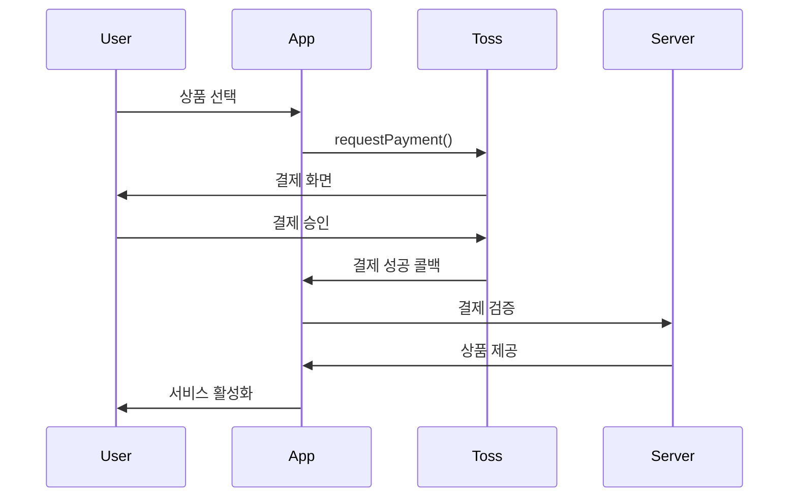

# 앱인토스 플랫폼 상세 개발 가이드

**작성일**: 2026-01-01
**프로젝트**: Destiny.OS (2026 신년운세 - MBTI 운세)
**크롤링 출처**: https://developers-apps-in-toss.toss.im/

---

## 📋 Executive Summary

### 핵심 발견
- ❌ **Flutter 미지원**: 앱인토스는 Web (WebView), React Native, Unity, Cocos만 지원
- ✅ **WebView 기반**: `@apps-in-toss/web-framework` NPM 패키지로 웹 앱 개발
- ✅ **인앱 결제 완비**: Apple/Google 정책 준수한 결제 시스템
- ✅ **빠른 개발**: 템플릿, 디자인 시스템, 가이드 제공 (5일 출시 가능)

### 최종 권장사항
**Option A (권장)**: Flutter Web 변환 (3-4주)
**Option B**: React 재개발 (6-8주)
**Option C (빠른 검증)**: 웹 MVP 별도 개발 (2주)

---

## 1. 지원 개발 환경

### 1.1 플랫폼 지원 현황

| 플랫폼 | 지원 | 용도 | 비고 |
|--------|------|------|------|
| **Web (WebView)** | ✅ | 일반 서비스 | React, Vue, Vanilla JS 등 |
| **React Native** | ✅ | 네이티브 성능 필요 시 | 토스 SDK 제공 |
| **Unity** | ✅ | 게임 | Unity SDK |
| **Cocos** | ✅ | 게임 | Cocos SDK |
| **Flutter** | ❌ | - | **미지원** |

### 1.2 WebView 개발 시작하기

#### 설치
```bash
# NPM 프로젝트 초기화
npm init -y

# 앱인토스 프레임워크 설치
npm install @apps-in-toss/web-framework

# 앱인토스 CLI 설치
npm install -g @apps-in-toss/cli
```

#### 환경 구성
```bash
# 앱인토스 프로젝트 초기화
ait init

# ait init 실행 시 생성되는 파일:
# - ait.config.js (앱 설정)
# - index.html (진입점)
# - src/ (소스 코드)
```

#### 로컬 개발 (Android Debug Bridge)
```bash
# Android 개발 서버 포트 포워딩
adb reverse tcp:8081 tcp:8081  # Metro 번들러
adb reverse tcp:5173 tcp:5173  # Vite 개발 서버

# 실행
npm run dev

# 토스 앱에서 QR 코드로 테스트
```

#### 토스앱에서 테스트하기

1. **토스 앱 열기**
2. **전체 탭** → **개발자 모드 활성화**
3. **QR 코드 스캔** or **테스트 URL 입력**
   - 로컬: `http://localhost:5173`
   - 샌드박스: `https://your-app.ait-dev.toss.im`

---

## 2. 핵심 기술 스택

### 2.1 권장 기술 스택 (Web)

```yaml
Frontend:
  Framework: React 18+ or Vue 3+
  Language: TypeScript
  State: Redux Toolkit / Zustand / Pinia
  Router: React Router / Vue Router

Build Tool:
  Bundler: Vite (권장) or Webpack

Backend:
  Database: Supabase (현재 프로젝트와 동일)
  Auth: Supabase Auth
  Storage: Supabase Storage

AI:
  Provider: BizRouter (권장) or OpenAI API
  Model: GPT-4o or Gemini 2.5 Flash

Payment:
  Provider: 토스 인앱 결제 SDK
  Method: 토스페이, 카드, 계좌이체
```

### 2.2 만세력 계산 (사주 로직)

#### Dart (현재)
```dart
import 'package:lunar/lunar.dart';

// 음력 변환
var lunar = Lunar.fromDate(DateTime(2026, 1, 1));
print(lunar.getYearInGanZhi()); // 병오년

// 사주 명식 산출
var bazi = lunar.getBaZi();
print(bazi.getYear()); // 연주
print(bazi.getMonth()); // 월주
print(bazi.getDay()); // 일주
print(bazi.getTime()); // 시주
```

#### JavaScript (변환 필요)
```javascript
// NPM 패키지: lunar-javascript
import { Lunar } from 'lunar-javascript';

// 음력 변환
const lunar = Lunar.fromDate(new Date(2026, 0, 1));
console.log(lunar.getYearInGanZhi()); // 병오년

// 사주 명식 산출
const bazi = lunar.getEightChar();
console.log(bazi.getYear()); // 연주
console.log(bazi.getMonth()); // 월주
console.log(bazi.getDay()); // 일주
console.log(bazi.getTime()); // 시주
```

**중요**: `lunar-javascript` 라이브러리가 Dart `lunar` 패키지와 동일한 API를 제공하는지 검증 필요.

---

## 3. 인앱 결제 시스템

### 3.1 결제 플로우



### 3.2 코드 예시

#### 1. 결제 요청
```javascript
import { requestPayment } from '@apps-in-toss/payment';

async function purchaseAIConsultation() {
  try {
    const result = await requestPayment({
      productId: 'ai_consultation_1',  // 상품 ID (사전 등록)
      productName: 'AI 운세 상담 1회',
      amount: 990,                      // 990원
      currency: 'KRW',
      metadata: {
        userId: 'user123',
        timestamp: Date.now()
      }
    });

    if (result.status === 'success') {
      // 결제 성공
      await activateService(result.paymentKey);
    }
  } catch (error) {
    console.error('결제 실패:', error);
    alert('결제에 실패했습니다. 다시 시도해주세요.');
  }
}
```

#### 2. 결제 검증 (서버)
```javascript
// Supabase Edge Function: verify-payment
import { serve } from 'https://deno.land/std@0.168.0/http/server.ts';
import { createClient } from 'https://esm.sh/@supabase/supabase-js@2';

serve(async (req) => {
  const { paymentKey, userId } = await req.json();

  // 토스 결제 API로 검증
  const response = await fetch(
    `https://api.tosspayments.com/v1/payments/${paymentKey}`,
    {
      headers: {
        Authorization: `Basic ${btoa(process.env.TOSS_SECRET_KEY + ':')}`,
      },
    }
  );

  const payment = await response.json();

  if (payment.status === 'DONE') {
    // Supabase에 결제 기록 저장
    const supabase = createClient(
      process.env.SUPABASE_URL,
      process.env.SUPABASE_SERVICE_KEY
    );

    await supabase.from('payments').insert({
      user_id: userId,
      payment_key: paymentKey,
      product_id: payment.productId,
      amount: payment.totalAmount,
      status: 'completed',
    });

    return new Response(JSON.stringify({ success: true }), {
      headers: { 'Content-Type': 'application/json' },
    });
  }

  return new Response(JSON.stringify({ success: false }), {
    status: 400,
    headers: { 'Content-Type': 'application/json' },
  });
});
```

### 3.3 상품 정의 예시

```javascript
// ait.config.js
export default {
  app: {
    id: 'destiny-os',
    name: '2026 신년운세',
  },
  products: [
    {
      id: 'ai_consultation_1',
      name: 'AI 운세 상담 1회',
      description: 'GPT-4o 기반 개인 맞춤 운세 상담',
      price: 990,
      currency: 'KRW',
      type: 'consumable',  // 소비성 (재구매 가능)
    },
    {
      id: 'ai_consultation_3',
      name: 'AI 운세 상담 3회 팩',
      description: '3회 묶음 구매로 17% 할인',
      price: 2490,
      currency: 'KRW',
      type: 'consumable',
    },
    {
      id: 'premium_monthly',
      name: '프리미엄 월간 구독',
      description: '일일 운세 + AI 상담 무제한',
      price: 4900,
      currency: 'KRW',
      type: 'subscription',  // 구독형
      period: 'monthly',
    },
  ],
};
```

### 3.4 수수료 구조

| 플랫폼 | 수수료율 | 비고 |
|--------|---------|------|
| Apple App Store | 30% | iOS 정책 |
| Google Play Store | 30% | Android 정책 |
| 토스 앱인토스 | 0% (베타) | 향후 정책 변경 가능 |

**판매가 구성**:
```
판매가 = 공급가 + VAT (10%)
예: 990원 = 900원 + 90원
```

**실수령액 계산** (iOS 기준):
```
990원 판매
- Apple 수수료 30%: 297원
- VAT: 90원
= 실수령: 603원
```

---

## 4. 개발 옵션별 상세 분석

### Option A: Flutter Web 변환 (권장)

#### 장점
- ✅ 기존 Dart 코드 70-80% 재사용
- ✅ 비즈니스 로직 유지 (사주 계산, MBTI 분석)
- ✅ 빠른 개발 (3-4주)

#### 단점
- ⚠️ Flutter Web 초기 로딩 느림 (번들 크기 문제)
- ⚠️ 앱인토스 SDK 연동 복잡도 증가
- ⚠️ WebView 제약 (네이티브 API 제한)

#### 기술 검증 체크리스트

```bash
# 1. Flutter Web 빌드 테스트
flutter build web --release

# 2. 번들 크기 확인
ls -lh build/web/
# 목표: main.dart.js < 2MB

# 3. 초기 로딩 시간 측정
# Chrome DevTools > Network > Disable cache
# 목표: FCP (First Contentful Paint) < 3s

# 4. Lighthouse 점수 측정
lighthouse https://destiny-os-test.web.app --view
# 목표: Performance > 70

# 5. 사주 계산 로직 검증
# Flutter Web에서 lunar 패키지 동작 확인
```

#### Flutter Web → 앱인토스 연동

```dart
// lib/main.dart
import 'package:flutter/material.dart';
import 'package:flutter_web_plugins/flutter_web_plugins.dart';
import 'dart:js' as js;

void main() {
  // URL 전략 설정 (해시 제거)
  setUrlStrategy(PathUrlStrategy());

  // 앱인토스 SDK 초기화
  js.context.callMethod('initAppsInToss', [
    js.JsObject.jsify({
      'appId': 'destiny-os',
      'version': '1.0.0',
    })
  ]);

  runApp(MyApp());
}
```

```javascript
// web/index.html
<!DOCTYPE html>
<html>
<head>
  <script src="https://cdn.appsintoss.com/sdk/web/v1/apps-in-toss.js"></script>
  <script>
    function initAppsInToss(config) {
      window.AppsInToss.init(config);
    }
  </script>
</head>
<body>
  <script src="main.dart.js"></script>
</body>
</html>
```

---

### Option B: React 재개발

#### 장점
- ✅ 앱인토스 공식 지원 (샘플 코드 풍부)
- ✅ 가벼운 번들 크기 (< 500KB)
- ✅ 빠른 초기 로딩

#### 단점
- ❌ 전체 재개발 필요 (로직 포팅)
- ❌ React 학습 필요 (팀 역량 의존)
- ❌ 개발 기간 증가 (6-8주)

#### 프로젝트 구조

```
destiny-os-web/
├── src/
│   ├── app/
│   │   └── App.tsx              # 메인 앱
│   ├── features/
│   │   ├── saju/                # 사주 분석
│   │   │   ├── api/
│   │   │   │   └── lunarApi.ts  # 만세력 API
│   │   │   ├── components/
│   │   │   │   ├── SajuInput.tsx
│   │   │   │   └── SajuResult.tsx
│   │   │   └── hooks/
│   │   │       └── useSaju.ts
│   │   ├── mbti/                # MBTI 분석
│   │   ├── fortune/             # 2026 운세
│   │   └── ai/                  # AI 상담
│   ├── shared/
│   │   ├── components/          # 공통 컴포넌트
│   │   ├── hooks/               # 공통 훅
│   │   └── utils/               # 유틸리티
│   └── main.tsx
├── public/
├── package.json
└── vite.config.ts
```

#### 핵심 컴포넌트 예시

```tsx
// src/features/saju/components/SajuInput.tsx
import { useState } from 'react';
import { useSaju } from '../hooks/useSaju';

export function SajuInput() {
  const [birthDate, setBirthDate] = useState('');
  const [birthTime, setBirthTime] = useState('');
  const { calculateSaju, loading } = useSaju();

  const handleSubmit = async () => {
    const result = await calculateSaju({
      date: birthDate,
      time: birthTime,
    });
    console.log(result);
  };

  return (
    <div className="saju-input">
      <input
        type="date"
        value={birthDate}
        onChange={(e) => setBirthDate(e.target.value)}
      />
      <input
        type="time"
        value={birthTime}
        onChange={(e) => setBirthTime(e.target.value)}
      />
      <button onClick={handleSubmit} disabled={loading}>
        {loading ? '계산 중...' : '운세 보기'}
      </button>
    </div>
  );
}
```

```typescript
// src/features/saju/api/lunarApi.ts
import { Lunar } from 'lunar-javascript';

export interface SajuInput {
  date: string;  // YYYY-MM-DD
  time: string;  // HH:mm
  isLunar?: boolean;
}

export interface SajuResult {
  yearGanZhi: string;   // 연주 (병오)
  monthGanZhi: string;  // 월주
  dayGanZhi: string;    // 일주
  timeGanZhi: string;   // 시주
  elements: {           // 오행
    wood: number;
    fire: number;
    earth: number;
    metal: number;
    water: number;
  };
}

export function calculateSaju(input: SajuInput): SajuResult {
  const [year, month, day] = input.date.split('-').map(Number);
  const [hour, minute] = input.time.split(':').map(Number);

  const lunar = Lunar.fromDate(new Date(year, month - 1, day));
  const bazi = lunar.getEightChar();

  return {
    yearGanZhi: bazi.getYear(),
    monthGanZhi: bazi.getMonth(),
    dayGanZhi: bazi.getDay(),
    timeGanZhi: bazi.getTime(),
    elements: calculateElements(bazi),
  };
}

function calculateElements(bazi: any) {
  // 오행 계산 로직
  // (기존 Flutter 코드 포팅 필요)
  return {
    wood: 0,
    fire: 0,
    earth: 0,
    metal: 0,
    water: 0,
  };
}
```

---

### Option C: 하이브리드 MVP (빠른 검증)

#### 전략
- **앱인토스**: 간소화된 웹 버전 (2주 개발)
- **네이티브 앱**: 풀 기능 Flutter 앱 (병행 개발)

#### MVP 범위

| 기능 | 웹 버전 | 네이티브 앱 |
|------|---------|------------|
| 사주 입력 | ✅ 간소화 | ✅ 풀 기능 |
| MBTI 입력 | ✅ | ✅ |
| 2026 운세 | ✅ 기본 | ✅ 상세 |
| AI 상담 | ✅ 1회 유료 | ✅ 무제한 구독 |
| 대운 타임라인 | ❌ | ✅ |
| 궁합 분석 | ❌ | ✅ |
| 공유 기능 | ✅ | ✅ |
| 알림 | ❌ | ✅ FCM |

#### 개발 리소스 배분

```yaml
Week 1-2: 웹 MVP
  - React 프로젝트 셋업
  - 사주 계산 로직 포팅
  - 기본 UI/UX
  - 인앱 결제 연동

Week 3-4: 검수 & 출시
  - 토스 검수 제출
  - 피드백 대응
  - 정식 오픈

Week 5+: 네이티브 앱 개발 병행
  - 앱인토스 유저 반응 모니터링
  - Flutter 앱 고도화
  - 앱 스토어 출시 준비
```

---

## 5. 로드맵 & 타임라인

### Phase 1: 기술 검증 (Week 1-2)

```yaml
목표: Flutter Web vs React 의사결정

Tasks:
  Day 1-3: Flutter Web 성능 테스트
    - [ ] flutter build web --release
    - [ ] Lighthouse 점수 측정
    - [ ] 초기 로딩 시간 (<3s 목표)
    - [ ] 번들 크기 (<2MB 목표)

  Day 4-7: 앱인토스 SDK 연동 POC
    - [ ] @apps-in-toss/web-framework 설치
    - [ ] 샘플 앱 실행
    - [ ] 토스 앱에서 테스트
    - [ ] 결제 SDK 테스트

  Day 8-10: 사주 계산 로직 검증
    - [ ] lunar-javascript 라이브러리 테스트
    - [ ] Flutter 앱과 결과 비교
    - [ ] 정확도 검증

  Day 11-14: 최종 의사결정
    - [ ] 성능 리포트 작성
    - [ ] 개발 방식 확정 (Flutter Web or React)
    - [ ] 타임라인 수립

산출물:
  - 기술 검증 리포트.md
  - 성능 벤치마크 데이터
  - 최종 개발 전략 문서
```

### Phase 2: MVP 개발 (Week 3-6)

**Option A (Flutter Web) 선택 시**:
```yaml
Week 3: 핵심 기능 구현
  - [ ] Flutter Web 프로젝트 셋업
  - [ ] 사주 입력 페이지
  - [ ] MBTI 입력 페이지
  - [ ] 2026 운세 페이지

Week 4: 결제 & AI 연동
  - [ ] 토스 인앱 결제 SDK 연동
  - [ ] AI 상담 API 연동 (BizRouter)
  - [ ] 결제 검증 서버 (Supabase Edge Function)

Week 5: UI/UX 개선
  - [ ] 반응형 디자인
  - [ ] 애니메이션 추가
  - [ ] 공유 기능 구현

Week 6: 테스트 & 디버깅
  - [ ] 크로스 브라우저 테스트
  - [ ] 결제 플로우 E2E 테스트
  - [ ] 성능 최적화
```

**Option B (React) 선택 시**:
```yaml
Week 3-4: React 프로젝트 셋업
  - [ ] Vite + React + TypeScript 프로젝트
  - [ ] Supabase 연동
  - [ ] 라우팅 설정 (React Router)
  - [ ] 상태 관리 (Redux Toolkit)

Week 5: 비즈니스 로직 포팅
  - [ ] lunar-javascript로 사주 계산
  - [ ] MBTI 분석 로직
  - [ ] 2026 운세 알고리즘

Week 6: 결제 & AI
  - [ ] 토스 결제 SDK
  - [ ] AI API 연동
  - [ ] 결제 검증 서버
```

### Phase 3: 검수 & 출시 (Week 7)

```yaml
Day 1-2: 검수 준비
  - [ ] 앱 아이콘 제작 (512x512, 1024x1024)
  - [ ] 스크린샷 캡처 (5-10장)
  - [ ] 앱 설명 작성 (500자 이내)
  - [ ] 개인정보처리방침 작성
  - [ ] 이용약관 작성
  - [ ] 면책 조항 추가

Day 3: 토스 개발자 센터 제출
  - [ ] https://developer.toss.im 회원가입
  - [ ] 앱 등록
  - [ ] 메타데이터 입력
  - [ ] 검수 제출

Day 4-5: 검수 대응
  - [ ] 피드백 확인
  - [ ] 수정 사항 반영
  - [ ] 재제출

Day 6-7: 정식 오픈
  - [ ] 검수 승인
  - [ ] 앱인토스 마켓에 노출
  - [ ] 모니터링 대시보드 확인
```

### Phase 4: 운영 & 개선 (Week 8+)

```yaml
일일 모니터링:
  - DAU (Daily Active Users)
  - 결제 전환율
  - AI 상담 품질
  - 에러율

주간 분석:
  - 유저 피드백 수집
  - A/B 테스트 (가격, UI)
  - 콘텐츠 업데이트 (일일 운세)

월간 개선:
  - 신규 기능 개발
    - 대운 타임라인
    - 커플 궁합 분석
  - 성능 최적화
  - 마케팅 캠페인
```

---

## 6. 예상 비용 & ROI

### 6.1 개발 비용 (Option A: Flutter Web)

```yaml
인건비:
  - 웹 개발자: 80시간 × 50,000원 = 4,000,000원
  - UI/UX 디자이너: 20시간 × 50,000원 = 1,000,000원
  소계: 5,000,000원

인프라 비용 (월):
  - Supabase: $25 (약 33,000원)
  - Firebase Hosting: $0 (무료 티어)
  - AI API (BizRouter): 100,000원 (예상)
  - 도메인: 10,000원
  소계: 143,000원/월

마케팅 비용:
  - 앱인토스: 0원 (무료 노출)
  - SNS 광고: 500,000원 (선택)

총 투자 (6개월):
  5,000,000 + (143,000 × 6) + 500,000 = 6,358,000원
```

### 6.2 예상 수익 (6개월)

**시나리오 1: 보수적** (MAU 10,000명)
```
유료 전환율: 5%
월 결제 유저: 500명
평균 결제액: 2,000원
---
월 매출: 1,000,000원
6개월 누적: 6,000,000원
순이익: 6,000,000 - 6,358,000 = -358,000원
ROI: -5.6%
손익분기점: 7개월차
```

**시나리오 2: 현실적** (MAU 30,000명)
```
유료 전환율: 7%
월 결제 유저: 2,100명
평균 결제액: 2,500원
---
월 매출: 5,250,000원
6개월 누적: 31,500,000원
순이익: 31,500,000 - 6,358,000 = 25,142,000원
ROI: 395%
손익분기점: 2개월차
```

**시나리오 3: 낙관적** (MAU 50,000명 + 바이럴)
```
유료 전환율: 10%
월 결제 유저: 5,000명
평균 결제액: 3,000원
---
월 매출: 15,000,000원
6개월 누적: 90,000,000원
순이익: 90,000,000 - 6,358,000 = 83,642,000원
ROI: 1,315%
손익분기점: 1개월차
```

---

## 7. 리스크 & 완화 전략

### 7.1 기술 리스크

| 리스크 | 확률 | 영향 | 완화 전략 |
|--------|------|------|----------|
| Flutter Web 성능 이슈 | 70% | 높음 | React 재개발 대안, 코드 스플리팅 |
| lunar-javascript 정확도 | 30% | 높음 | 교차 검증, 테스트 케이스 100개 |
| 앱인토스 SDK 버그 | 20% | 중간 | 토스 개발자 커뮤니티 활용 |
| AI API 비용 폭증 | 50% | 중간 | 일일 예산 설정, 캐싱 전략 |

### 7.2 비즈니스 리스크

| 리스크 | 확률 | 영향 | 완화 전략 |
|--------|------|------|----------|
| 낮은 유저 유입 | 40% | 높음 | 토스 인텔리전스 배너 활용, SNS 마케팅 |
| 낮은 결제 전환율 | 50% | 높음 | 무료 체험 제공, 가격 A/B 테스트 |
| 검수 반려 | 30% | 중간 | 가이드라인 철저 준수, 사전 검토 |
| 경쟁 서비스 등장 | 60% | 중간 | 퍼스트 무버, 차별화 (AI 상담) |

### 7.3 법적 리스크

| 리스크 | 확률 | 영향 | 완화 전략 |
|--------|------|------|----------|
| 개인정보 보호법 | 10% | 높음 | Supabase 암호화, GDPR 준수 |
| 환불 요청 증가 | 30% | 중간 | 명확한 환불 정책, 샘플 제공 |
| 사주 명리학 민원 | 20% | 낮음 | "오락 목적, 과학적 근거 없음" 표기 |

---

## 8. 다음 단계

### 즉시 실행 가능한 액션

#### 1. Flutter Web 성능 테스트 (오늘)
```bash
cd /Users/seunghan/mbti_luck
flutter build web --release
cd build/web
python3 -m http.server 8000
# http://localhost:8000 접속해서 체감 속도 확인
```

#### 2. lunar-javascript 검증 (내일)
```bash
mkdir -p test-lunar-js
cd test-lunar-js
npm init -y
npm install lunar-javascript
```

```javascript
// test.js
import { Lunar } from 'lunar-javascript';

// 테스트 케이스: 2026년 1월 1일
const lunar = Lunar.fromDate(new Date(2026, 0, 1));
console.log('연주:', lunar.getYearInGanZhi());  // 병오년
console.log('월주:', lunar.getMonthInGanZhi());
console.log('일주:', lunar.getDayInGanZhi());

// Flutter 앱 결과와 비교
```

#### 3. 앱인토스 샘플 앱 테스트 (2일차)
```bash
npx @apps-in-toss/cli create my-test-app
cd my-test-app
npm install
npm run dev

# Android 디바이스에서 테스트
adb reverse tcp:5173 tcp:5173
# 토스 앱 > 전체 > 개발자 모드 > QR 스캔
```

#### 4. Go/No-Go 의사결정 (2주 후)
- ✅ Flutter Web 성능 OK → **진행**
- ❌ Flutter Web 성능 NG → **React 재개발** or **보류**

---

## 9. 참고 자료

### 공식 문서
- 앱인토스 개발자 센터: https://developers-apps-in-toss.toss.im/
- WebView 가이드: https://developers-apps-in-toss.toss.im/development/webview
- React Native 가이드: https://developers-apps-in-toss.toss.im/development/react-native
- 인앱 결제: https://developers-apps-in-toss.toss.im/revenue/in-app-purchase
- API 레퍼런스: https://developers-apps-in-toss.toss.im/api/overview

### 성공 사례
- DiscountSpot: https://toss.im/apps-in-toss/blog/discountspot
- 앱인토스 블로그: https://toss.im/apps-in-toss/blog

### 개발 커뮤니티
- 토스 개발자 포럼: https://forum.toss.im
- Discord: (추후 공개 예정)

---

**작성자**: Claude Code AI
**최종 업데이트**: 2026-01-01
**다음 리뷰**: 2주 후 (기술 검증 완료 시)
